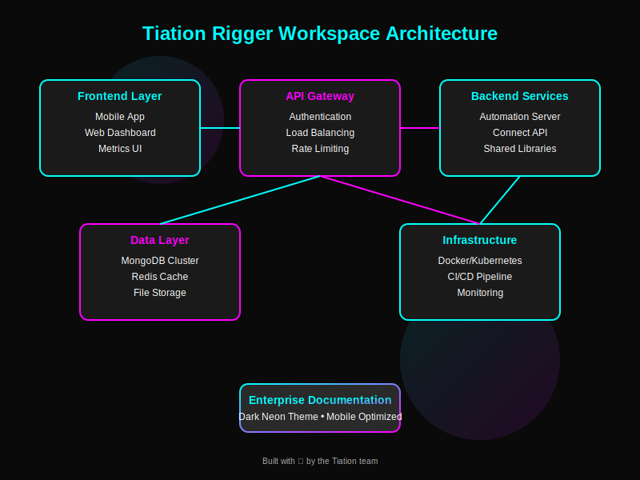
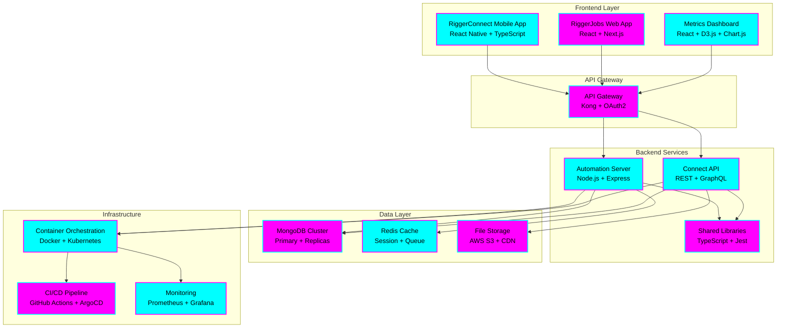

# tiation-rigger-workspace-docs

<div align="center">


**Professional documentation for Tiation Rigger workspace**

*Comprehensive • Professional • Well-Documented*

[](https://github.com/tiation/tiation-rigger-workspace-docs)
[](https://github.com/tiation/tiation-rigger-workspace-docs)
[](https://github.com/tiation/tiation-rigger-workspace-docs)
[](https://github.com/tiation/tiation-rigger-workspace-docs)

</div>

---
<div align="center">


## 🏗️ Architecture



### System Components



### Technology Stack

#### **Frontend Technologies**
- **Mobile**: React Native 0.72+, TypeScript, Expo SDK
- **Web**: React 18+, Next.js 13+, Redux Toolkit
- **UI/UX**: Dark Neon Theme, Responsive Design, PWA Support
- **Testing**: Jest, React Testing Library, Detox (E2E)

#### **Backend Technologies** 
- **Runtime**: Node.js 18+, TypeScript 5+
- **Framework**: Express.js, Fastify (high performance)
- **API**: REST, GraphQL, WebSocket (real-time)
- **Authentication**: JWT, OAuth2, SAML SSO

#### **Database & Storage**
- **Primary DB**: MongoDB 6+ (Atlas Cloud)
- **Caching**: Redis 7+ (Cluster mode)
- **File Storage**: AWS S3, CloudFront CDN
- **Search**: Elasticsearch 8+ (full-text search)

#### **Infrastructure & DevOps**
- **Containers**: Docker, Kubernetes (EKS)
- **CI/CD**: GitHub Actions, ArgoCD
- **Monitoring**: Prometheus, Grafana, Jaeger
- **Cloud**: AWS (multi-region), Terraform IaC

---

## 📋 Table of Contents

- [Features](#-features)
- [Quick Start](#-quick-start)
- [Installation](#-installation)
- [Usage](#-usage)
- [Documentation](#-documentation)
- [Screenshots](#-screenshots)
- [FAQ](#-faq)
- [Contributing](#-contributing)
- [Support](#-support)
- [License](#-license)
- [About Tiation](#-about-tiation)

---

## ✨ Features

### 🚀 **Enterprise-Grade Platform**
- **Scalable Architecture**: Cloud-native design supporting thousands of concurrent users
- **Real-time Synchronization**: Instant data sync across mobile and web applications
- **Advanced Security**: Enterprise-level authentication, encryption, and access controls
- **Comprehensive Analytics**: Deep insights into workforce performance and project metrics
- **Multi-platform Support**: Native iOS/Android apps + responsive web applications
- **Offline Capabilities**: Full functionality without internet connectivity

### 🛠️ **Professional Tools**
- **Job Management System**: Complete lifecycle from posting to completion
- **Rigger Network Platform**: AI-powered matching of skills to opportunities
- **Automated Workflows**: Streamlined processes with intelligent automation
- **Document Management**: Centralized storage for certificates, permits, and documentation
- **Communication Hub**: Integrated messaging and notification system
- **Compliance Tracking**: Automated safety and regulatory compliance monitoring

### 📊 **Business Intelligence**
- **Performance Dashboards**: Real-time KPI tracking and reporting
- **Predictive Analytics**: Forecast demand and optimize resource allocation
- **Cost Management**: Detailed financial tracking and budget optimization
- **Quality Assurance**: Automated quality control and performance monitoring
- **Custom Reporting**: Flexible report generation for stakeholders
- **Integration APIs**: Seamless connection with existing enterprise systems

---

## 🏃‍♂️ Quick Start

```bash
# Clone the repository
git clone https://github.com/tiation/tiation-rigger-workspace-docs.git
cd tiation-rigger-workspace-docs

# Install dependencies
npm install

# Start development server
npm run dev

# Build for production
npm run build
```

**🌐 Live Documentation**: [https://tiation.github.io/tiation-rigger-workspace-docs](https://tiation.github.io/tiation-rigger-workspace-docs)

---

## 📦 Installation

### Prerequisites

- **Node.js**: Version 18.0.0 or higher
- **npm**: Version 8.0.0 or higher
- **Git**: Latest version
- **Modern Browser**: Chrome 90+, Firefox 88+, Safari 14+
- **Optional**: Docker for containerized development

### Installation Steps

1. **Clone the repository**
   ```bash
   git clone https://github.com/tiation/tiation-rigger-workspace-docs.git
   cd tiation-rigger-workspace-docs
   ```

2. **Install dependencies**
   ```bash
   # Install all project dependencies
   npm install
   
   # Install optional development tools
   npm install --save-dev
   
   # Verify installation
   npm run test
   ```

3. **Environment Configuration**
   ```bash
   # Copy environment template
   cp .env.example .env
   
   # Configure your environment variables
   # Edit .env file with your specific settings
   
   # Validate configuration
   npm run lint
   ```

4. **Docker Setup (Optional)**
   ```bash
   # Build Docker image
   docker build -f Dockerfile.docs -t tiation-rigger-docs .
   
   # Run containerized version
   docker-compose up -d
   ```

---

## 🎯 Usage

### Basic Usage

#### **Development Server**
```bash
# Start local development server
npm run dev
# Access at http://localhost:8000
```

#### **Documentation Navigation**
- **📋 Getting Started**: Complete setup and deployment guide
- **🏗️ Architecture**: System design and component interactions
- **📚 API Reference**: Comprehensive endpoint documentation
- **🔧 Developer Guide**: Code examples and best practices
- **🚀 Deployment**: Production deployment strategies

### Advanced Usage

#### **Custom Theme Configuration**
```bash
# Build custom CSS with dark neon theme
npm run build:css

# Customize color variables in assets/css/style.scss
# --neon-cyan: #00ffff
# --neon-magenta: #ff00ff
# --gradient-primary: linear-gradient(135deg, #00ffff 0%, #ff00ff 100%)
```

#### **Content Management**
```bash
# Validate all documentation links
npm run test:links

# Format all markdown files
npm run format

# Run comprehensive quality checks
npm run ci
```

#### **Production Deployment**
```bash
# Build optimized production version
npm run build

# Deploy to GitHub Pages
git add .
git commit -m "Deploy documentation updates"
git push origin main
```

### Examples

#### **API Integration Example**
```javascript
// Connect to Rigger Platform API
const riggerAPI = new RiggerAPI({
  baseURL: 'https://api.riggerconnect.com',
  apiKey: process.env.RIGGER_API_KEY,
  version: 'v1'
});

// Fetch active jobs
const jobs = await riggerAPI.jobs.getActive({
  location: 'Sydney',
  skills: ['crane-operator', 'rigger-level-3'],
  urgent: true
});
```

#### **Mobile App Integration**
```typescript
// React Native component example
import { RiggerConnectSDK } from '@tiation/rigger-sdk';

const JobsList = () => {
  const [jobs, setJobs] = useState([]);
  
  useEffect(() => {
    RiggerConnectSDK.getAvailableJobs()
      .then(setJobs)
      .catch(console.error);
  }, []);
  
  return (
    <JobsContainer>
      {jobs.map(job => (
        <JobCard key={job.id} job={job} />
      ))}
    </JobsContainer>
  );
};
```

#### **Infrastructure as Code**
```yaml
# docker-compose.yml for local development
version: '3.8'
services:
  docs:
    build:
      context: .
      dockerfile: Dockerfile.docs
    ports:
      - "8000:8000"
    volumes:
      - .:/workspace
    environment:
      - NODE_ENV=development
      - THEME=dark-neon
```

---

## 📚 Documentation

- **[User Guide](docs/user-guide.md)** - Complete user documentation
- **[API Reference](docs/api-reference.md)** - Technical API documentation
- **[Architecture](docs/architecture.md)** - System architecture overview
- **[Deployment Guide](docs/deployment.md)** - Production deployment instructions
- **[Developer Guide](docs/developer-guide.md)** - Development setup and guidelines

### Live Documentation

Visit our [GitHub Pages site](https://tiation.github.io/tiation-rigger-workspace-docs) for interactive documentation.

---

## 📸 Screenshots

<div align="center">
  
  <p><em>Main application interface</em></p>
</div>

<div align="center">
  
  <p><em>Analytics dashboard</em></p>
</div>

---

## ❓ FAQ

### General Questions

**Q: What makes this solution enterprise-grade?**
A: Our solution includes comprehensive security, scalability, monitoring, and enterprise integration features with professional support.

**Q: Is this compatible with existing systems?**
A: Yes, we provide extensive API and integration capabilities for seamless system integration.

**Q: What support options are available?**
A: We offer community support through GitHub Issues and professional enterprise support for commercial users.

### Technical Questions

**Q: What are the system requirements?**
A: **Minimum System Requirements:**
- **OS**: Windows 10+, macOS 10.15+, Ubuntu 20.04+
- **Memory**: 8GB RAM (16GB recommended)
- **Storage**: 10GB free space
- **CPU**: 2-core (4-core recommended)
- **Network**: Broadband internet connection
- **Browser**: Chrome 90+, Firefox 88+, Safari 14+, Edge 90+

**Production Environment:**
- **Server**: AWS EC2 t3.medium or equivalent
- **Database**: MongoDB 6+ with 3-node replica set
- **Cache**: Redis 7+ cluster with 3 nodes
- **Load Balancer**: Application Load Balancer (ALB)
- **CDN**: CloudFront for global content delivery
- **Monitoring**: CloudWatch, Prometheus, Grafana stack

**Q: How do I handle large scale deployments?**
A: See our [Deployment Guide](docs/deployment.md) for enterprise-scale deployment strategies.

**Q: Are there any security considerations?**
A: Yes, please review our [Security Guide](docs/security.md) for comprehensive security best practices.

### Troubleshooting

**Q: Common installation issues**
A: Check our [Troubleshooting Guide](docs/troubleshooting.md) for solutions to common problems.

**Q: Performance optimization**
A: Refer to our [Performance Guide](docs/performance.md) for optimization strategies.

---

## 🤝 Contributing

We welcome contributions! Please see our [Contributing Guide](CONTRIBUTING.md) for details.

### Development Setup

1. Fork the repository
2. Create a feature branch
3. Make your changes
4. Add tests
5. Submit a pull request

### Code of Conduct

Please read our [Code of Conduct](CODE_OF_CONDUCT.md) before contributing.

---

## 🆘 Support

### Community Support

- **GitHub Issues**: [Report bugs or request features](https://github.com/tiation/tiation-rigger-workspace-docs/issues)
- **Discussions**: [Join community discussions](https://github.com/tiation/tiation-rigger-workspace-docs/discussions)
- **Documentation**: [Browse our documentation](https://tiation.github.io/tiation-rigger-workspace-docs)

### Enterprise Support

For enterprise customers, we offer:
- Priority support
- Custom development
- Training and consultation
- SLA guarantees

Contact us at [tiatheone@protonmail.com](mailto:tiatheone@protonmail.com)

---

---

## 🔮 Tiation Ecosystem

This repository is part of the Tiation ecosystem. Explore related projects:

- [🌟 TiaAstor](https://github.com/TiaAstor/TiaAstor) - Personal brand and story
- [🐰 ChaseWhiteRabbit NGO](https://github.com/tiation/tiation-chase-white-rabbit-ngo) - Social impact initiatives
- [🏗️ Infrastructure](https://github.com/tiation/tiation-rigger-infrastructure) - Enterprise infrastructure
- [🤖 AI Agents](https://github.com/tiation/tiation-ai-agents) - Intelligent automation
- [📝 CMS](https://github.com/tiation/tiation-cms) - Content management system
- [⚡ Terminal Workflows](https://github.com/tiation/tiation-terminal-workflows) - Developer tools

---
*Built with 💜 by the Tiation team*